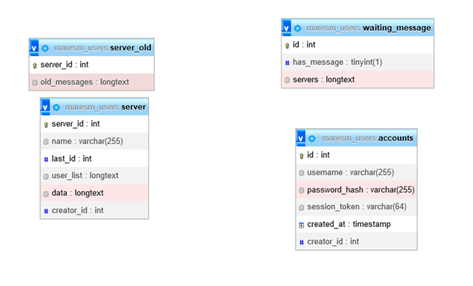
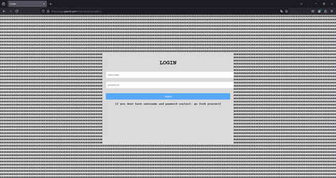
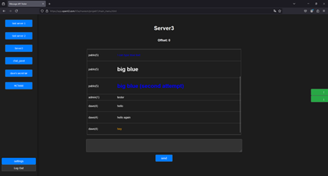

## desckclone

# Dokumentace
## About

This is a simplified Discord clone with a few differences:
  1. No one controls the servers.
  2. You cannot simply delete stuff.
  3. Only logged-in accounts can create new accounts.
  4. It is easy to modify the code.

# Requiraments
  PHP server MYsql DB
  
# How to Use
##As an Admin: 
  Upload the SQL structure, and in the PHP script, modify the username and
  password for accessing the database. Then start creating users.
  first autocreated acount username: admin password: test  
   
##As a User: 
  Ask someone to create an account for you, then use that username and
  password to log in (it is recommended to change the password afterward). Modify
  your server list if there are servers you were added to, or create your own server.
  You can also add another user.<bbr>
  
# How It Works
There is an API that supports many actions, including:
(login, check_message, add_message, get_messages, get_server_name, logout,
get_servers, change_servers, get_user_id, change_username, change_password,
create_user, create_server)
There is also a method to get the username from a user ID.
The frontend uses these functions to perform controlled modifications to the
database. The frontend can be freely changed—even users can modify it to make
it more useful.

# How Does It Feel
This is how the site normally looks, but it is recommended to modify the code and
make it look better, as I am awful at designing frontends. Users themselves are
also allowed to modify their frontend to make it work and look better. 
 
 
 
 
 
